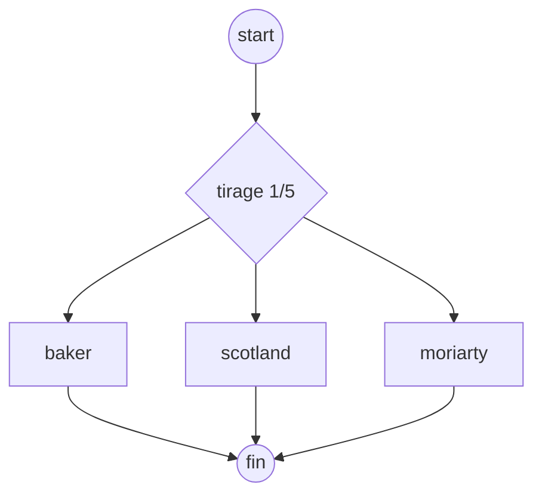
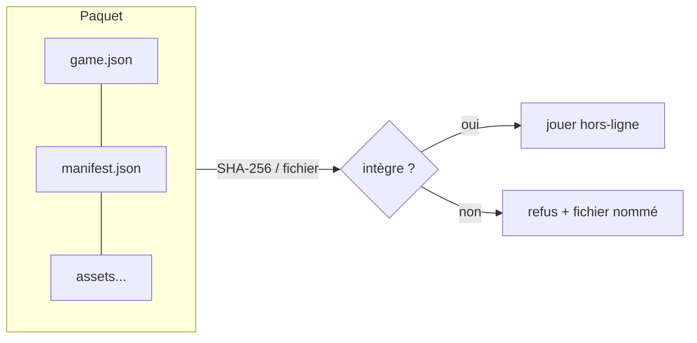

## Un jeu = un graphe orienté {data-background-color="#1a1a2e"}

- **Nœud** (node) : `module {type, data}` + `activation {requires[], operator}` + verrou (`latch`) + effets.
- **Cycle d'état** : `LOCKED → UNLOCKED → ACTIVE → COMPLETED`, une seule modale `ACTIVE`, file d'attente FIFO.
- **Terminaison** : au moins un nœud `isEnding` ; atteignabilité prouvée sous hypothèse d'environnement favorable.

## Conditions et tirage

- `GEOFENCE` (rayon + prédicat + tolérance + hystérésis), `NODE_COMPLETED`, `TIMER` (ancre + délai), `POOL_DRAWN`, `PROXIMITY_MASTER` (balise BLE/Wi-Fi), `ITEM_REQUIRED`/`ITEM_USED`, `CODE_INPUT`, `CLUE_RESOLVED`.
- Opérateur `AND`/`OR` obligatoire dès 2 conditions (schéma pur `if/then`).
- `RANDOM_POOL` : tirage sans remise, `drawCount ≤ candidats`, ordre topologique, persistance immédiate — **jamais recalculé** (reprise = même session).

## 5 modèles de navigation, 7 présentations {data-background-color="#1a1a2e"}

| Modèle | Idée | Présentations typiques |
|---|---|---|
| `BASIC` | Course d'orientation | `MAP` |
| `GUIDED` | Parcours guidé / diaporama | `STORY` |
| `TREASURE_HUNT` | Chasse au trésor | `CLUE + MAP` |
| `ESCAPE_GAME` | Escape game | `CLUE + TOOLBOX` |
| `OPEN_EXPLORATION` | Exploration libre | `MAP` |

Présentations : `MAP` (carte), `LIST` (liste), `STORY` (récit), `CLUE` (indices), `TOOLBOX` (boîte à outils), `TIMELINE` (frise), **`HOME` (tableau de bord)** — combinables librement.

## Le registre de modules : 10 types, zéro casse

| Type | Capteur | Secours |
|---|---|---|
| `QUIZ` | aucun | — |
| `DIFFERENCE_GAME` (7 erreurs) | tactile + dilatation 44 px | — |
| `PUZZLE` | tactile / clavier | état restauré |
| `AR_MARKER` | caméra | **fallback 2D obligatoire** |
| `BOUSSOLE` | cap magnétique | code animateur |
| `CODE_INPUT` | clavier | essais / temps |
| `INFO` | aucun | récit paginé multimédia |
| `CLUE_RESOLVER` | — | révèle un nœud |
| `ITEM_DROPPER` / `ITEM_CONSUMER` | inventaire | donnent / retirent |

Règle d'or : ajouter un type = une entrée au registre + un sous-schéma versionné. **Le schéma nœuds/liens ne bouge jamais.**

## Inventaire et atelier {data-background-color="#1a1a2e"}

- **Objets** : icône + illustration, `consumable` (consommable), `stackable` (cumulable) ; boîte à outils persistante (icône 🎒, overlay, `inventoryAccess` par nœud).
- **Recettes** (crafting) : `poudre + lettre → message` (destruction) ou `loupe + carte → carte annotée` (outil conservé) — application **atomique** (tout ou rien).
- **Événements journalisés** (6 types fermés : `INVENTORY_OPENED`, `ITEM_SELECTED`, `ITEM_USED`, `ITEM_COMBINED`, `ITEM_GIVEN`, `ITEM_REMOVED`) : le journal **est** le bus — les mini-jeux y affichent des indices (`inventoryHints`) sans changer l'état.
- Validation : références existantes, anti-farming direct (sortie jamais parmi les entrées), `consume` cohérent avec `consumable`.

## Tableau de bord HOME et compatibilité

- `HOME` : temps écoulé de session, **comptes à rebours par POI** lus des `TIMER` (`ancre + délai − nowMs`, ancre absente → « — »), états fait/à faire, bouton « Ouvrir : tête de file ».
- **Compatibilité par canal** (`player-compatibility`) : matrice des capacités natif vs PWA (GPS de fond et verrouillage OS : jamais en PWA) ; verdict `compatible / dégradé / refusé` affiché à l'export **et** réévalué au lancement.
- Exemple : GPS de fond exigé → refusé en PWA, compatible en natif ; `AR_MARKER` → dégradé avec fallback 2D.

## Offline-first : le paquet {data-background-color="#1a1a2e"}

- Manifeste `{path, version, size, sha256}` : **seule** source d'intégrité ; téléchargement différentiel, reprenable, non lançable si partiel.
- Persistance SQLite : progression, tirages, événements, inventaire — écriture immédiate, reprise par `sessionId`.
- Catalogue : transport non fiable assumé — le player revérifie tout.

## Trois players, un moteur

- **Partagé** (Kotlin Multiplatform, `commonMain`) : évaluation, file, tirages, inventaire, recettes, minuteurs — ~64 tests.
- **Android natif** (Views + Room), **iOS** (même partagé), **PWA** (Compose WebAssembly, installable, CI vers Pages).
- Frontières natives ciblées uniquement : GPS, boussole, caméra, Bluetooth, kiosque (`androidMain`/`iosMain`, jamais de logique métier).

## Validation double couche

1. **Couche 1 — forme** (Draft-07, AJV) : types, requis, `operator` if/then, enums fermés, `additionalProperties: false` partout.
2. **Couche 2 — applicative** : cycles (hors `allowCycle`), atteignabilité, topo des pools, AND-sur-branches-exclusives, références, recettes, `preset` obsolète rejeté.

F-.ex. : Sherlock Holmes et la fixture 5-POI passent C1+C2 à **0 erreur** ; tout export non valide est **refusé avec le fautif nommé**.
