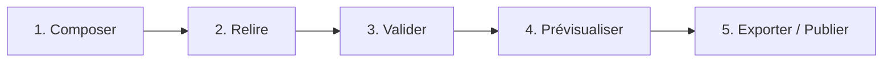

## Le workflow en 5 temps {data-background-color="#1a1a2e"}

1. **Composer** : graphe + écrans WYSIWYG (« tel écrit, tel écran »).
2. **Relire** : statuts `draft → reviewed → published` + relecteur (`reviewedBy`), overlay source des assets.
3. **Valider** : verdicts C1/C2 séparés, erreurs cliquables vers le fautif.
4. **Prévisualiser** : essai pas-à-pas, triche tracée (badge SIMULÉ), terminal joueur simulé.
5. **Exporter / Publier** : fichier local ou catalogue (code à 4 chiffres) — porte unique, checklist pré-export.

## La logique applicative en 4 couches

| Couche | Question | Exemple Sherlock |
|---|---|---|
| **Progression** | Quel chemin ? | start → tirage 1/5 → branche → fin |
| **Discovery** (découverte) | Qui voit quoi ? | `ON_COMPLETED`, `ON_CLUE`, `MAP`… |
| **Activation** | Qu'est-ce qui débloque ? | `GEOFENCE` 30 m, `ITEM_REQUIRED` clé |
| **Effets** | Que produit la complétion ? | `GIVE_ITEM` loupe, `REVEAL_NODE` message |

Cycle d'état unique pour tous les modèles : `LOCKED → UNLOCKED → ACTIVE → COMPLETED`. Découverte, activation, progression et présentation restent **indépendantes**.

## Composer : graphe et écrans {data-background-color="#1a1a2e"}

- **Canvas graphe** : nœuds déplaçables, arêtes = activation, icônes par condition ; undo/redo ; toggle graphe / carte / plan (fonds MapLibre ou plan d'étage, calibration 2 clics, alerte chevauchement).
- **Canvas écran** : zones `header/content/footer/overlay`, widgets texte / image / bouton / progression / module ; héritage de styles global → écran → widget.
- **Modèles** (templates) : `basic-story`, `quiz-focus`, `map-fullscreen`… + modèles d'auteur enregistrables.
- Règle d'or : **aucun état visuel sans équivalent JSON** — l'export est toujours conforme.

## Configurer : modules, inventaire, global

- **Mini-jeu d'abord** : le type choisi à la création initialise l'écran (`defaultScreen`) ; changer de type remplace les données (avec confirmation).
- **Familles d'inspecteur** : épreuve → activation → latch/rejeu → découverte → effets → inventaire → position.
- **Inventaire** : écran dédié (créer, illustrer, dupliquer, réordonner, import depuis le catalogue avec traçabilité) ; **recettes** d'atelier (`inputs + consume → output`).
- **Global** : navigation + présentation (dont `HOME`), style d'expérience, branding typé, mode/difficulté, HOLD kiosque, GPS/carte.

## Publier et exporter {data-background-color="#1a1a2e"}

- **Porte unique** : l'écran Exporter concentre checklist (C1, C2, brouillons, compatibilité par canal) et génération.
- **Fichier** : `game.json` + manifeste + assets, téléchargement local.
- **Catalogue** : publier → code à 4 chiffres ; republication → même code, nouvelle version courante ; import par code côté Studio via l'écran Importer (recherche nom/code).
- Brouillon auto-sauvegardé en local (`localStorage`), jamais dans l'export ; thème sombre/clair de confort.

## Cas d'utilisation (1/2)

- **Chasse au trésor** (`TREASURE_HUNT`, `CLUE + MAP`) : indices révélant des zones, géorepérage (geofence) élargi en forêt, tirage d'embranchements.
- **Escape game** (`ESCAPE_GAME`, `CLUE + TOOLBOX`) : boîte à outils, combinaisons d'objets, cadenas (`CODE_INPUT`), fallback RA.
- **Visite guidée** (`GUIDED`, `STORY`) : récit séquentiel, GPS facultatif, PWA sans installation.

## Cas d'utilisation (2/2)

- **Rallye scolaire** (`BASIC`, `MAP`) : 5 POI, quiz notés, difficulté `ENFANT` (rayons élargis, indices fréquents).
- **Souterrain / indoor** : `PROXIMITY_MASTER` (balise BLE du téléphone animateur), plans d'étage, QR + code tournant en secours — **zéro GPS requis**.
- **Borne associative** : mode kiosque (HOLD : `guidedAccess`, `screenPinning`, `lockTask`), sortie animateur par PIN, journal `holdBlock`/`holdExit` ; APK en sideload, PWA par Web Clip MDM.

## Boucle qualité : jamais seul face au terrain {data-background-color="#1a1a2e"}

::: {.incremental}
- **Validation** : pastille `✓ Valide / ⚠ N problèmes` partout, détail groupé par catégorie dans Valider.
- **Relecture humaine** : compteur de brouillons permanent — aucun `draft` exporté hors mode animateur.
- **Fixture neutre 1/5 → FIN** : rejouée en un clic comme non-régression.
- **Triche tracée partout** : bypass capteurs, `forceDraw`, position simulée — chaque event porte son badge, jamais confondu avec le réel.
- **Mode animateur** : triche + bypass capteurs + sortie HOLD, pensés pour le jour J.
:::

## Prochaine étape

::: {.r-fit-text}
Votre jeu pilote en 5 temps, accompagné.
:::

1. Atelier graphe : vos lieux, vos étapes, votre récit.
2. Habillage : écrans, images, branding.
3. Validation + preview au bureau.
4. Publication : code à 4 chiffres.
5. Jour J : flotte, borne, animateur — puis réutilisation.
