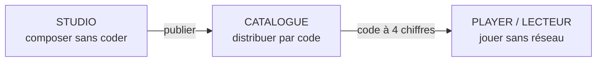

## Vous venez d'une solution équivalente {data-background-color="#1a1a2e"}

Vous savez déjà faire un jeu de piste géolocalisé.

::: {.incremental}
- ...mais chaque jeu est un **développement sur mesure** (custom development) ?
- ...mais le contenu est **câblé dans le code** (hardcoded) ?
- ...mais sans réseau sur le terrain, **rien ne marche** ?
- ...mais tester un parcours exige **d'aller sur place** ?
:::

**GeoPlay répond à ces quatre douleurs, par construction.**

::: {.notes}
Public : équipe projet historienne + financeurs. Tenir 12 minutes.
:::

## L'idée en une phrase

::: {.r-fit-text}
Pas **un** jeu : une **usine à jeux** (game factory).
:::

Le créateur compose visuellement. La plateforme distribue. Le joueur joue **hors-ligne** (offline).

Aucune ligne de code n'est écrite pour un jeu donné — jamais.

## Les trois piliers {data-background-color="#1a1a2e"}

| Pilier | Rôle | Devise |
|---|---|---|
| **Studio** | Éditeur visuel du créateur | « Glisser, relier, publier » |
| **Catalogue** (catalog) | Service de distribution versionné | « Un code, un jeu, une version courante » |
| **Player** (lecteur) | Application joueur natif + web | « Télécharger une fois, jouer partout » |

## Pilier 1 — Studio : l'usine

- **Graphe** (graph) de nœuds (nodes) : chaque étape = une instance de module + ses conditions.
- **Écrans** (screens) composés en WYSIWYG (« tel écrit, tel écran ») : ce que l'auteur voit est ce que le joueur verra.
- **Double validation** : forme (schéma JSON, Draft-07) + applicative (cycles, atteignabilité, références).
- **Prévisualisation traçée** : on rejoue le parcours au bureau, chaque triche de test est **tracée** (flagged), le JSON source n'est jamais touché.

## Pilier 2 — Catalogue : la distribution

- Publier = déposer un **paquet** (pack) versionné : `game.json` + manifeste (`manifest`) avec empreinte SHA-256 par fichier.
- Chaque jeu reçoit un **code à 4 chiffres** — simple identifiant d'accès, assumé non secret.
- Republier garde le code, ajoute une version ; l'ancienne reste adressable.
- Borne, QR code, lien ou saisie manuelle : tous mènent au même paquet **byte-identique** à l'export.

## Pilier 3 — Player : le terrain

- **Vérification** : chaque fichier est contrôlé (empreinte SHA-256) ; paquet partiel ou corrompu = refusé avec le fichier nommé.
- **100 % hors-ligne** après téléchargement : carte, énigmes, boussole, inventaire.
- **Trois lecteurs, un seul moteur** : Android natif, iOS, et PWA (application web progressive) installable — même logique partagée (Kotlin Multiplatform).
- Reprise exacte après coupure : même identifiant de session, aucun re-tirage.

## Les garanties philosophiques {data-background-color="#1a1a2e"}

::: {.incremental}
1. **Généricité** (genericity) : tout ce qui est spécifié vaut pour n'importe quel jeu, jamais câblé pour un cas.
2. **Hors-ligne d'abord** (offline-first) : le réseau n'est exigé ni à la création ni au jeu — seulement à la distribution.
3. **Valider avant le terrain** : aucun jeu invalide ne part sur le terrain, par construction.
4. **Extensible sans casse** : un nouveau mini-jeu s'enregistre, le schéma des nœuds ne bouge pas.
:::

## Ce qui change pour vous

| Avant (solution sur mesure) | Avec GeoPlay |
|---|---|
| Contenu dans le code | Contenu dans un graphe JSON validé |
| Refonte par jeu | Nouveau jeu = nouveau graphe, zéro code |
| Tests sur le terrain | Prévisualisation traçée au bureau |
| Un seul canal | Natif + web, même moteur |
| Maintenance par les développeurs | Maintenance par les créateurs |

## La méthode aussi est nouvelle {data-background-color="#1a1a2e"}

- **Piloté par les spécifications** (spec-driven) : chaque évolution est proposée, spécifiée, conçue puis appliquée — traçabilité totale (OpenSpec).
- **Mise en œuvre assistée par IA** : agents de codage opérant sur ces spécifications, preuves exécutées à chaque tâche (tests, contrôles).
- Résultat : 27 spécifications vivantes, ~50 tests natifs, contrôles automatiques — le dossier que vous lisez est généré depuis le même socle.

## Feuille de route (roadmap) et appel

- Socle achevé : graphe, Studio, moteur partagé, catalogue, inventaire, tableau de bord.
- En cours : onglet Accueil Studio, plans d'intérieur, PWA hors-ligne renforcée.
- **Prochaine étape proposée** : atelier de cadrage sur VOTRE premier jeu pilote — un graphe, un terrain, une équipe.

::: {.notes}
Terminer par la démo : publier Sherlock, saisir le code, jouer hors-ligne.
:::
